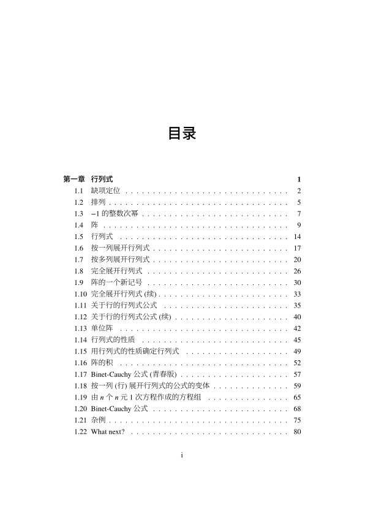
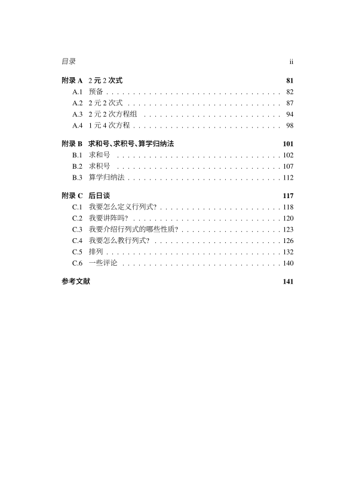
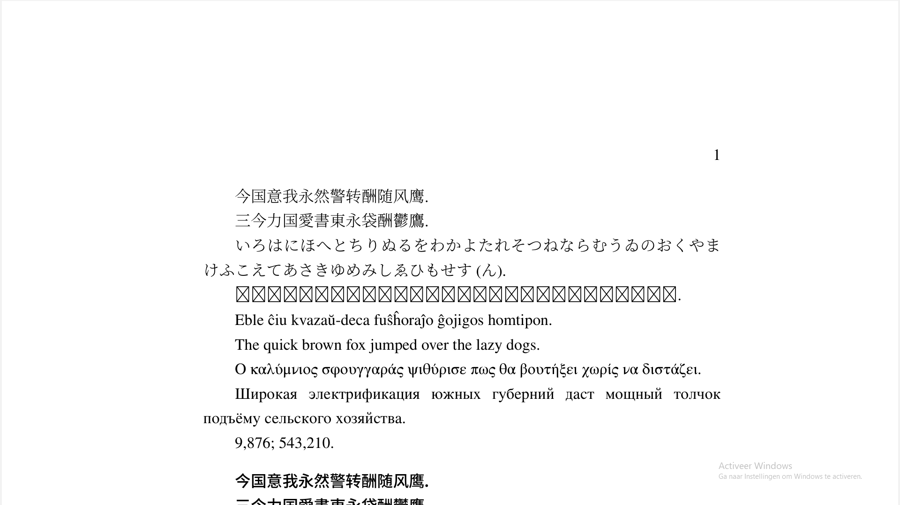

# 行列式入门

我用约二分之五周时间写了一本《行列式入门》.
正如其标题所言, 它是一本为初学者准备的行列式教材.
行列式是一个有用的工具.
我认为, 掌握此工具是有用的.
本书用较简单的归纳法定义行列式,
并较严谨地证明了关于行列式的一些结论
(当然, 有些东西被留作习题了).






## 只想看书?

- ~~[https://gitee.com/septsea/det/raw/main/main.pdf](https://gitee.com/septsea/det/raw/main/main.pdf)~~
- [https://github.com/septsea/det/raw/main/main.pdf](https://github.com/septsea/det/raw/main/main.pdf)
- [https://www.123pan.com/s/QvKUVv-K4WHA](https://www.123pan.com/s/QvKUVv-K4WHA)
- [https://www.bilibili.com/read/cv21269691](https://www.bilibili.com/read/cv21269691)

本书甚至还有一套[教学片](https://www.bilibili.com/video/BV13D4y1p7QW/);
不过, 我想, 您不一定会喜欢它.
毕竟, 我作教学片的目的是修改书的错误.
我不一定改正了所有的错误;
但, 至少, 比不作教学片时要好多了.

## 想编书?

我置本书的代码于:

- [https://gitee.com/septsea/det](https://gitee.com/septsea/det)
- [https://github.com/septsea/det](https://github.com/septsea/det)

**获取方法甲:** (推荐)

打开命令行.
执行下列四句话的任意一句.
假如您失败了, 您可多试几次, 或换一句话.

```bash
git clone https://gitee.com/septsea/det.git
```

```bash
git clone git@gitee.com:septsea/det.git
```

```bash
git clone https://github.com/septsea/det.git
```

```bash
git clone git@github.com:septsea/det.git
```

假如您不知道 `git clone` 的作用, 请自行了解之.
不管是百度还是谷歌还是必应还是其他都比我强.

**获取方法乙:** (较不推荐)

您打开

- [https://gitee.com/septsea/det](https://gitee.com/septsea/det)
- [https://github.com/septsea/det](https://github.com/septsea/det)

的任意一个, 然后下载所有的文件为一个压缩文件即可.

具体地, 要么点
```
克隆/下载 ---> 下载ZIP
```
要么点
```
Code ---> Download ZIP
```
这里的 `--->` 表示 "然后".

### 怎么编?

有了书的代码, 您可能想试编译本书.
我有很多方法 (但本质只有一个) 使您编译之.

我假定您可正常地使用乳胶 (LaTeX).

当我说 "执行" 时, 请您打开一个可执行命令的窗口,
并进入 `README.md` 所在的目录.

您可使用下面的任何一个方法编本书:
- 执行 `make` .
(假如您无法执行它, 就换下一个方法.
下同.)
- 执行 `latexmk -xelatex -file-line-error -synctex=1 -interaction=nonstopmode -halt-on-error -silent main` .
- 用视觉工作室代码 (Visual Studio Code) 打开含 `README.md` 的目录.
具体地, 在视工代里,
按一下 `F1` 或 `Ctrl+Shift+p` 或 `Command+Shift+p` ,
输入 `File: Open Folder` ,
再点一下含 "File: Open Folder..." 的项.
然后, 找到含 `README.md` 的目录, 打开之.
假如您装了 James Yu 的 LaTeX Workshop,
那您就可以方便地编译本书.
(假如您没有装它, 那为什么不装一个呢?)
- 执行 `make lua` .
- 执行 `latexmk -lualatex -file-line-error -synctex=1 -interaction=nonstopmode -halt-on-error -silent main` .
- 假如您不喜欢我给出的办法,
那您当然也可用自己喜欢的办法;
您编出来就行.
我只提一个硬要求: **用 XeLaTeX 或 LuaLaTeX**.
(至少, 我能用 XeLaTeX 或 LuaLaTeX 无问题地编译本书.)

### 关于字体

我用到了如下的字体:
- [Source Han Serif CN](https://mirrors.tuna.tsinghua.edu.cn/adobe-fonts/source-han-serif/SubsetOTF/CN/)
- [Sarasa Mono SC](https://mirrors.tuna.tsinghua.edu.cn/github-release/be5invis/Sarasa-Gothic/LatestRelease/)
- [XITS](https://ctan.org/pkg/xits)
- [Fira Sans](https://ctan.org/pkg/fira)
- [XITS Math](https://ctan.org/pkg/xits)
- [TeX Gyre Termes Math](https://ctan.org/pkg/tex-gyre-math-termes)
- [STIX Two Math](https://ctan.org/pkg/stix2-otf)

一般地, 完整的 TeX Live 套装含
XITS, Fira Sans, XITS Math, TeX Gyre Termes Math, STIX Two Math.
所以, 您一般不必安装这 5 种字体.
您安装 Source Han Serif CN 与 Sarasa Mono SC 即可.

安装 Source Han Serif CN 是较方便的:
- 可以只安装本书用到的 [Source Han Serif CN Light](https://mirrors.tuna.tsinghua.edu.cn/adobe-fonts/source-han-serif/SubsetOTF/CN/SourceHanSerifCN-Light.otf);
- 也可[点这里](https://mirrors.tuna.tsinghua.edu.cn/adobe-fonts/source-han-serif/SubsetOTF/CN/)手动下载自己需要的字重;
- 甚至也可[点这里](https://mirrors.tuna.tsinghua.edu.cn/adobe-fonts/source-han-serif/SubsetOTF/SourceHanSerifCN.zip)下载全字重压缩包.

但是, 安装 Sarasa Mono SC 就不是很方便了.
它提供了四个压缩包,
但因为每一个压缩包里有很多我们 (大概率) 用不到的字体,
故,
若您相信我,
您可以[点这里](https://www.123pan.com/s/QvKUVv-ufWHA)下载 Sarasa Mono SC.
`Lite.zip` 只含本书用到的
Sarasa Mono SC Light,
Sarasa Mono SC Light Italic,
Sarasa Mono SC Semibold,
Sarasa Mono SC Semibold Italic,
而 `Full.zip` 含 10 个版本
(含 5 种字重, 每种字重都有 "正体" 与 *"斜体"*).

我教您怎么安装字体.
我假定您使用窗系统 (Windows).
选中字体文件 (`.ttf` 文件 / `.otf` 文件).
(注意, 您可以一次选多个.)
右击它 (们).
**点一下 "为所有用户安装".**
很简单吧?
若您使用其他的系统, 您就自行寻找方法吧.

我准备了一个小文件 `testfonts.tex`.
若您认为, 您的电脑里已有这 7 种字体,
且乳胶认识它们,
那就可以试编 `testfonts.tex`,
检验此事:
可以执行 `make testfonts` ;
可以执行 `latexmk -xelatex -file-line-error -interaction=nonstopmode -halt-on-error -silent -g testfonts` ;
也可用视工代辅助编译.
当然, 若您不想用这些方法, 那您就自己想办法吧.

注意, 编出这样的东西是十分正常的,
因为 Source Han Serif CN
似乎不含朝鲜语的文字.



**您当然也可使用其他的字体; 您手动修改即可.**

### 关于 "美客" (`make`)

您当然可在窗上用美客.
[去这儿下载](https://sourceforge.net/projects/ezwinports/files/).
一般, 下载 `make-x.y-without-guile-w32-bin.zip` 即可
(其中 `x.y` 是版本号).
您置 `make.exe` 所在的文件夹于环境变量里,
就能用 `make` 了.

**美客只是可选项.**

---

佚名

2023 年 1 月 21 日
